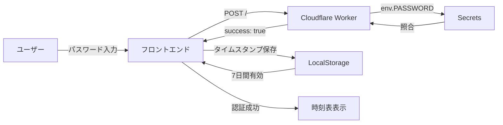

---
tags:
  - engineering
  - train-timetable
  - done
---
# 🚃 乗車効率化くん

> 阪急電車（十三⇔梅田）の時刻表検索アプリケーション

## 📋 概要

指定時刻から次の5本の電車を検索できるWebアプリケーション。パスワード認証により、特定ユーザーのみがアクセス可能。

**公開URL**: https://oshomadesse.github.io/train-timetable/

---

## 🎯 主な機能

### 1. パスワード認証システム
- **認証API**: Cloudflare Workers
- **セッション管理**: LocalStorage（7日間有効）
- **セキュリティ**: Secrets管理によるパスワード保護

### 2. 時刻表検索
- **対象駅**: 十三 ⇔ 梅田
- **対応路線**: 京都線、神戸線、宝塚線
- **時刻表種別**: 平日 / 土日祝
- **表示内容**: 発車時刻、路線、ホーム番号、列車種別、行き先

### 3. リアルタイム検索
- 現在時刻を自動入力
- 指定時刻以降の次の5本を表示
- 路線別カラーリング（京都線：緑、神戸線：青、宝塚線：オレンジ）

---

## 🏗️ 技術スタック

| カテゴリ | 技術 |
|---------|------|
| **フロントエンド** | HTML5, CSS3, Vanilla JavaScript |
| **認証API** | Cloudflare Workers |
| **ホスティング** | GitHub Pages |
| **データ管理** | LocalStorage (認証状態), JSON (時刻表データ) |
| **バージョン管理** | Git / GitHub |

---

## 📁 ディレクトリ構造

```
🚃 train-timetable/
├── index.html              # メインHTML
├── css/
│   └── style.css          # スタイルシート
├── js/
│   └── app.js             # メインロジック + 認証システム
├── src/
│   └── index.js           # Cloudflare Worker認証コード
├── data/                  # 時刻表JSONデータ
│   ├── juso_to_umeda/     # 十三→梅田
│   │   ├── kyoto_weekday.json
│   │   ├── kyoto_weekend.json
│   │   ├── kobe_weekday.json
│   │   ├── kobe_weekend.json
│   │   ├── takarazuka_weekday.json
│   │   └── takarazuka_weekend.json
│   └── umeda_to_juso/     # 梅田→十三
│       ├── kyoto_weekday.json
│       ├── kyoto_weekend.json
│       ├── kobe_weekday.json
│       ├── kobe_weekend.json
│       ├── takarazuka_weekday.json
│       └── takarazuka_weekend.json
├── wrangler.json          # Cloudflare Workers設定
└── favicon.png            # ファビコン
```

---

## 🔐 認証フロー



### 認証ロジック

1. **初回アクセス**
   - パスワードオーバーレイが表示される
   - ユーザーがパスワードを入力
   - Cloudflare Workers APIに POST リクエスト

2. **認証成功**
   - 現在時刻をタイムスタンプとして LocalStorage に保存
   - オーバーレイを非表示
   - 時刻表機能にアクセス可能

3. **再訪問時**
   - LocalStorage のタイムスタンプをチェック
   - 7日間以内 → 自動ログイン
   - 7日間経過 → 再度パスワード入力が必要

---

## 🚀 デプロイ手順

### 1. Cloudflare Workers のセットアップ

```bash
# リポジトリをクローン
git clone https://github.com/oshomadesse/train-timetable.git

# Cloudflare Workers にデプロイ（自動）
# GitHub push時に自動デプロイ
```

**必要な設定**:
- Cloudflare Workers Dashboard で `PASSWORD` シークレットを設定
- Cloudflare Access を **OFF** に設定（重要）

### 2. GitHub Pages のセットアップ

1. GitHubリポジトリの Settings → Pages
2. Source: `main` ブランチ
3. 自動デプロイ完了

---

## 🎨 デザイン仕様

### カラーパレット

| 種別 | 要素 | カラーコード | 用途 |
|------|------|------------|------|
| **メイン** | 背景 | `#451722` | Body背景 |
| **メイン** | ボタン（選択時）ボーダー | `#656230` | 十三・梅田ボタン |
| **メイン** | ボタン（選択時）背景 | `#ADA952` | 十三・梅田ボタン選択時 |
| **メイン** | ボタン（選択時）テキスト | `#FFFFFF` | 十三・梅田ボタン選択時 |
| **アクセント** | 京都線 | `#00A040` | 路線バッジ・カード |
| **アクセント** | 神戸線 | `#0068B7` | 路線バッジ・カード |
| **アクセント** | 宝塚線 | `#FF6600` | 路線バッジ・カード |

### レスポンシブ対応

- デスクトップ: 最大幅500px
- モバイル: 画面幅100%（パディング調整）
- iOS Safari対応: time input の表示崩れ対策実装済み

---

## 📊 データ構造

### 時刻表JSONフォーマット

```json
{
  "juso_to_umeda": [
    {
      "time": "05:30",
      "line": "kyoto",
      "platform": "6",
      "type": "普通",
      "destination": "大阪梅田"
    }
  ]
}
```

---

## 🔧 メンテナンス

### 時刻表データの更新

1. `data/` ディレクトリ内のJSONファイルを編集
2. JSONフォーマットを厳守（最終行にカンマを付けない）
3. Git commit & push

### 認証パスワードの変更

1. Cloudflare Workers Dashboard → Settings → Variables
2. `PASSWORD` シークレットを編集
3. 自動的にWorkerに反映

---

## 🐛 トラブルシューティング

### 1. 認証エラー「認証に失敗しました」

**原因**: Cloudflare Access が ON になっている

**解決策**:
1. Cloudflare Dashboard → Zero Trust → Access controls → Applications
2. `train-timetable.oshomadesse.workers.dev` の設定を確認
3. Cloudflare Access を **OFF** にする

### 2. JSONパースエラー

**原因**: JSONファイルの最終行に余計なカンマがある

**解決策**:
```bash
# JSONファイルの検証
python3 -m json.tool data/juso_to_umeda/kyoto_weekday.json
```

### 3. 時刻表データが読み込めない

**原因**: ファイルパスの誤りまたはJSONフォーマットエラー

**解決策**:
- ブラウザの開発ツール（Network タブ）でエラーを確認
- JSONファイルの構文を検証

---

## 📝 開発履歴

### 2026-01-18
- ✅ パスワード認証システム実装
- ✅ Cloudflare Workers API デプロイ
- ✅ 認証セッション 7日間に延長
- ✅ ボタンカラーを `#656230` に変更
- ✅ JSONパースエラー修正（takarazuka_weekday.json）
- ✅ UI改善：背景を単色化、ボタン背景色調整、検索後の自動スクロール実装
- ✅ ボタン選択時のカラー最適化（背景 `#ADA952`、テキスト白）
- ✅ 認証成功後に最上部へ自動スクロール実装
- ✅ 検索後スクロール位置を最適化（最下部20px上、80ms）

### 主要コミット

| コミット | 内容 |
|---------|------|
| `6e080c8` | 検索後スクロール位置調整（20px上、80ms） |
| `73d04bf` | 検索後スクロール位置を10px上に調整 |
| `c59d148` | 認証成功後に最上部へスクロール |
| `231dfe3` | スクロールタイミング微調整（90ms） |
| `16e88b1` | ボタン選択時カラー最適化（#ADA952背景、白テキスト） |
| `7d5fa81` | UI改善：背景単色化・自動スクロール実装 |
| `2307e00` | プライマリーカラー変更 #451722 に統一 |
| `5880138` | ボタンカラー変更 #656230 |
| `7edc0e6` | 認証セッション 1日 → 7日に延長 |
| `46f2a6e` | Cloudflare Worker認証コード追加 |
| `aaf1d0d` | Cloudflare Workers API URL設定 |
| `16816ad` | JSONパースエラー修正 |

---

## 🛡️ セキュリティ考慮事項

### 実装済み

- ✅ パスワード認証（Cloudflare Workers Secrets）
- ✅ CORS設定（適切なヘッダー）
- ✅ セッション管理（7日間の有効期限）

### 推奨事項

- 🔒 定期的なパスワード変更
- 🔒 HTTPS通信の強制（GitHub Pages標準）
- 🔒 認証失敗のレート制限（将来的な改善）

---

## 📞 サポート

### 関連リンク

- **リポジトリ**: https://github.com/oshomadesse/train-timetable
- **公開URL**: https://oshomadesse.github.io/train-timetable/
- **Cloudflare Workers**: https://train-timetable.oshomadesse.workers.dev

### 問題報告

GitHubのIssuesで報告してください。

---

## 📄 ライセンス

Private Repository - All Rights Reserved

---

**最終更新**: 2026-01-19
**バージョン**: 1.0.0
**開発者**: Shoma (oshomadesse)
